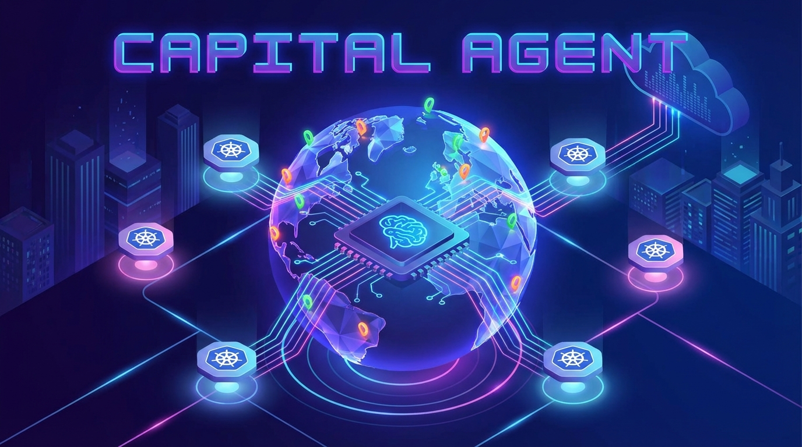
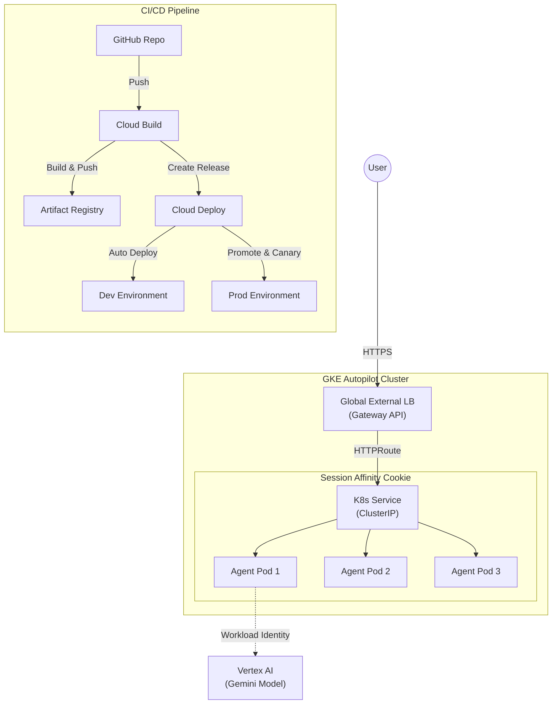

# GKE AI Agent Demo with Vertex AI (中文版)



本项目演示了如何在 **Google Kubernetes Engine (GKE) Autopilot** 上进行 AI Agent 应用的生产级部署。它包含一个完整的 GitOps 风格 CI/CD 流水线（使用 **Cloud Build** 和 **Cloud Deploy**），并通过 **Gateway API** 实现了高级网络功能。

## 🏗️ 架构

系统包含两个环境（**Dev** 和 **Prod**），并使用全球外部负载均衡器（Global External Load Balancer）来路由流量。Good



## ✨ 核心特性

-   **GKE Autopilot**: 用于 Dev 和 Prod 的全托管 Kubernetes 集群。
-   **Gateway API**: 使用 `gke-l7-global-external-managed` 实现现代化的全球负载均衡。
-   **金丝雀发布 (Canary Deployment)**: 生产环境发布使用 Cloud Deploy 的 **50% 金丝雀** 策略。
-   **会话亲和性 (Session Affinity)**: 通过 `GCPBackendPolicy` 配置，确保基于内存的 Agent 状态能够保持会话粘性。
-   **工作负载身份 (Workload Identity)**: 安全、无密钥的方式访问 Vertex AI。
-   **健康检查 (Health Checks)**: 自定义 `HealthCheckPolicy`，确保负载均衡器检查 `/healthz` 而不是默认的根路径。

## 🔒 安全与 IAM 设计

本项目采用 **最小权限 (Least Privilege)** 安全模型，构建和运行时使用不同的服务账号。

### 1. 构建时: `cloudbuild-sa`
-   **角色**: 仅供 Cloud Build 用于构建镜像和部署到 GKE。
-   **权限**:
    -   `roles/container.developer`: 部署到 GKE 集群。
    -   `roles/clouddeploy.releaser`: 创建和管理 Cloud Deploy 发布。
    -   `roles/artifactregistry.writer`: 推送 Docker 镜像。
    -   `roles/iam.serviceAccountUser`: 在部署期间模拟 Compute Engine SA（GKE Autopilot 所需）。

### 2. 运行时: `agent-sa` + Workload Identity
-   **角色**: 供 AI Agent Pod 访问 Vertex AI。
-   **机制**: **工作负载身份 (Workload Identity)**。
    -   我们创建一个 Google 服务账号 (`agent-sa`) 并赋予 `roles/aiplatform.user` 权限。
    -   将其绑定到一个 Kubernetes 服务账号 (`agent-ksa`)。
    -   Pod 使用 `agent-ksa`，从而在不需要密钥文件的情况下有效地“模拟” `agent-sa`。
-   **优势**: 应用程序 **没有长期存在的密钥**。访问权限严格授予集群中运行的 Pod。

## 🚀 快速开始

### 前置条件
-   Google Cloud Project (已启用计费)。
-   已安装 `terraform`。
-   已安装 `gcloud` CLI。
-   已连接到 Cloud Build 的 GitHub 仓库。

### 1. 基础设施设置
使用 Terraform 预配 GKE 集群、CI/CD 流水线和 IAM 角色。

> [!IMPORTANT]
> **GitHub 连接**: 在运行 Terraform 之前，请确保您的 GitHub 仓库已在 [Google Cloud Console](https://console.cloud.google.com/cloud-build/triggers/connect) 中连接到 Cloud Build。如果您尚未操作，需要手动授权 Google Cloud Build GitHub App。

```bash
cd infra
# 初始化 Terraform
terraform init

# 应用配置
# 请替换为您的 GitHub 信息
terraform apply -var="repo_owner=YOUR_GITHUB_USER" -var="repo_name=YOUR_REPO_NAME"
```

### 2. 应用部署
部署通过 Git 触发器自动完成。

1.  提交并推送更改到 `main` 分支。
    ```bash
    git add .
    git commit -m "feat: Initial deployment"
    git push
    ```
2.  **Cloud Build** 将自动构建镜像并创建 Cloud Deploy 发布。
3.  **Cloud Deploy** 将：
    -   自动部署到 **Dev** 集群。
    -   等待人工批准以晋升到 **Prod**。
4.  在 Google Cloud Console 中批准发布，开始向 Prod 进行 **50% 金丝雀** 滚动更新。

## ⚠️ 重要说明与故障排除

### 健康检查 (`/healthz`)
应用程序暴露了一个专用的健康检查端点 `/healthz`。
-   **原因**: 根路径 `/` 可能会返回 `307 Redirects`（例如跳转到 UI），这会导致负载均衡器将后端标记为不健康。
-   **配置**: 我们使用 `HealthCheckPolicy` (`env/healthcheckpolicy.yaml`) 显式告知 Gateway 检查 `/healthz`。

### 会话亲和性 (Sticky Sessions)
AI Agent 将对话历史存储在内存中。
-   **问题**: 如果没有亲和性，请求可能会打到不同的 Pod，导致“会话未找到 (Session Not Found)” (404) 错误。
-   **解决方案**: 将 `GCPBackendPolicy` (`env/backendpolicy.yaml`) 应用于 Service 以启用 `GENERATED_COOKIE` 亲和性。这确保用户始终连接到同一个 Pod。

### Gateway 预配
首次部署 `Gateway` 资源时，全球负载均衡器 IP 的预配和流量开始转发可能需要 **5-10 分钟**。
